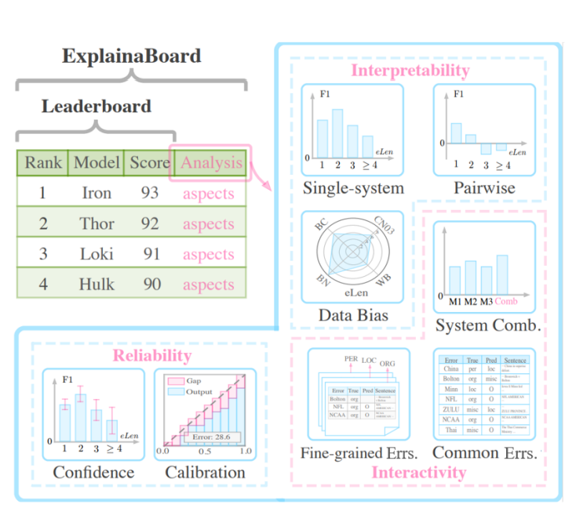
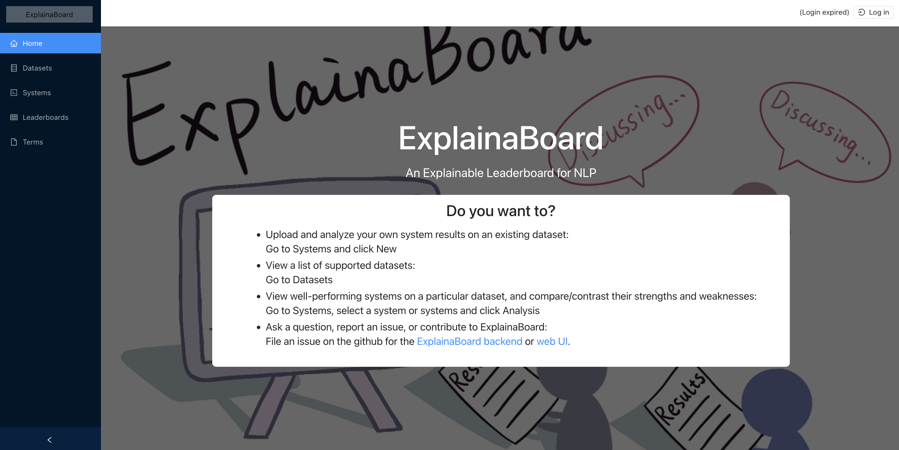

# ExplainaBoard: An Explainable Leaderboard for NLP

<p align="center">
  
  <br />
  <br />
  <a href="https://github.com/neulab/ExplainaBoard/blob/main/LICENSE"></a>
  <a href="https://github.com/neulab/ExplainaBoard/stargazers"></a>
  <a href="https://pypi.org/project//"></a>
  <a href="https://github.com/psf/black"></a>
  <a href=".github/workflows/ci.yml"></a>
</p>

## What is ExplainaBoard?

When developing a natural language processing (NLP or AI) system, often one of the hardest things is to understand where your system is working and where it is failing, and deciding what to do next. ExplainaBoard is a tool that *inspects your system outputs*, *identifies what is working and what is not working*, and helps *inspire you with ideas of where to go next*.



It offers a number of different ways with which you can evaluate and understand your data:

1. *Single-system Analysis*: What is a system good or bad at?
2. *Pairwise Analysis*: Where is one system better (worse) than another?
3. *Data Bias Analysis*: What are the characteristics of different evaluated datasets?
4. *Common Errors*: What are common mistakes that top-5 systems made?
5. *Fine-grained Error Analysis*: where do errors occur?
6. *System Combination*: Is there potential complementarity between different systems?


## Using Explainaboard

ExplainaBoard can be used online or offline.

### Online Usage

Browse the [**web interface**](https://explainaboard.inspiredco.ai), which gives you the
ability to browse outputs and upload your own system outputs.

<a href="https://explainaboard.inspiredco.ai"></a>

### Offline Usage

First, follow the installation directions below, then take a look at our
[**CLI examples**](docs/cli_interface.md).


**Install Method 1 - Standard Use:** Simple installation from PyPI (Python 3 only)

```
pip install --upgrade pip  # recommending the newest version of pip.
pip install explainaboard
python -m spacy download en_core_web_sm  # if you plan to use the TextClassificationProcessor
```

**Install Method 2 - Development:** Install from the source and develop locally (Python 3 only)

```bash
# Clone current repo
git clone https://github.com/neulab/ExplainaBoard.git
cd ExplainaBoard

# Install the required dependencies and dev dependencies
pip install ."[dev]"
pre-commit install
```

- **Testing:** To run tests, you can run `python -m unittest`. 
- **Linting and Code Style:** This project uses flake8 (linter) and black (formatter). They are enforced in the pre-commit hook and in the CI pipeline.
    - run `python -m black .` to format code
    - run `flake8` to lint code
    - You can also configure your IDE to automatically format and lint the files as you are writing code.

After trying things out in the [CLI](docs/cli_interface.md), you can read how to add
new [features](docs/add_new_features.md), [tasks](docs/add_new_tasks.md), or
[file formats](docs/add_new_formats.md).

## Acknowledgement

ExplainaBoard is developed by Carnegie Mellon University, Inspired Cognition Inc., and other collaborators.
If you find it useful in research, you can cite it in papers:

    @inproceedings{liu-etal-2021-explainaboard,
        title = "{E}xplaina{B}oard: An Explainable Leaderboard for {NLP}",
        author = "Liu, Pengfei and Fu, Jinlan and Xiao, Yang and Yuan, Weizhe and Chang, Shuaichen and Dai, Junqi and Liu, Yixin and Ye, Zihuiwen and Neubig, Graham",
        booktitle = "Proceedings of the 59th Annual Meeting of the Association for Computational Linguistics and the 11th International Joint Conference on Natural Language Processing: System Demonstrations",
        month = aug,
        year = "2021",
        address = "Online",
        publisher = "Association for Computational Linguistics",
        url = "https://aclanthology.org/2021.acl-demo.34",
        doi = "10.18653/v1/2021.acl-demo.34",
        pages = "280--289",
    }

We thanks all authors who share their system outputs with us: Ikuya Yamada, Stefan Schweter,
Colin Raffel, Yang Liu, Li Dong. We also thank
Vijay Viswanathan, Yiran Chen, Hiroaki Hayashi for useful discussion and feedback about ExplainaBoard.

