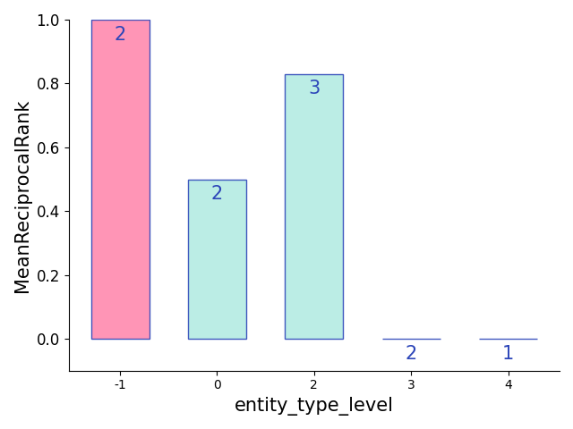

# Analyzing Knowledge Graph Link Tail Prediction Task


In this file we describe how to analyze models trained to predict the tail entity on knowledge graph link prediction tasks, for example
[`fb15k-237`](https://www.microsoft.com/en-us/download/details.aspx?id=52312).

## Outline
* Evaluation with Build-in Features
    * Data Preparation
    * Perform Analysis with CLI
    * Visualization Locally
* Evaluation with Customized Features
    * Data Preparation
    * Perform Analysis with CLI


## Evaluation with Build-in Features


### Data Preparation
In order to perform analysis of your results, they should be in the following
JSON format:

```json
[
    {
        "gold_head": "/m/08966",
        "gold_predicate": "/travel/travel_destination/climate./travel/travel_destination_monthly_climate/month",
        "gold_tail": "/m/05lf_",
        "predict": "tail",
        "predictions": [
            "/m/05lf_",
            "/m/02x_y",
            "/m/01nv4h",
            "/m/02l6h",
            "/m/0kz1h"
        ],
        "true_rank": 1
    },
    {
        "gold_head": "/m/01hww_",
        "gold_predicate": "/music/performance_role/regular_performances./music/group_membership/group",
        "gold_tail": "/m/01q99h",
        "predict": "tail",
        "predictions": [
            "/m/05563d",
            "/m/02vnpv",
            "/m/02r1tx7",
            "/m/017lb_",
            "/m/03c3yf"
        ],
        "true_rank": 23,
    },
    ...
    
]
```
where
* `gold_head`: true head entity
* `gold_predicate`: true relation
* `gold_tail`: true tail entity
* `predict`: it suggest what type of information (e.g., `head`, `predicate`, `tail`) will be predicted
* `predictions`: a list of predictions

Let's say we have one system output file: 
* [test-kg-prediction-no-user-defined.json](https://github.com/neulab/ExplainaBoard/blob/main/explainaboard/tests/artifacts/test-kg-prediction-no-user-defined.json) 


### Perform Analysis with CLI

In order to perform your basic analysis, we can run the following command:

```shell
explainaboard --task kg-link-tail-prediction --custom_dataset_paths ./data/system_outputs/fb15k-237/test-kg-prediction-no-user-defined.json --system_outputs ./data/system_outputs/fb15k-237/test-kg-prediction-no-user-defined.json > report.json

```
where
* `--task`: denotes the task name. 
* `--custom_dataset_paths`: the path of test samples
* `--system_outputs`: denote the path of system outputs. Multiple one should be 
  separated by space, for example, system1 system2
* `--dataset`:optional, denotes the dataset name
* `report.json`: the generated analysis file with json format. Tips: use a json viewer like [`this one`](http://jsonviewer.stack.hu/) for better interpretation.

If the dataset has been supported by [`DataLab`](https://github.com/ExpressAI/DataLab/tree/main/datasets),
you could also run (the advantage is that more bucketing features will be supported):

```shell
    explainaboard --task kg-link-tail-prediction --dataset fb15k_237 --sub_dataset origin --system_outputs test_distmult.json > log.res
```
where 
* `test_distmult.json` represents the system output file, for example, you can download
the above one [here](https://datalab-hub.s3.amazonaws.com/predictions/test_distmult.json
)


### Bucketing Features
* Toy feature `tail_entity_length`: the number of words in `true_tail`
* More meaningful features to be added soon


### Visualization Locally
Once the above command has been successfully conducted, histogram figures will be generated automatically in the folder
`./output/figures/test-kg-prediction-no-user-defined-new/`, where each figure represent a fine-grained evaluation
results along one features (e.g., relation type).
 
We have carefully designed and beautified these figures which 
could be directly applied for paper writing as needed.

One example is shown below,





## Evaluation with Customized Features

### Data Preparation

ExplainaBoard also allows users to customize features, specifically to provide your own bucketing features, submit a system output containing a declaration of your user-defined features (their names, data types, and number of buckets), along with your predictions on test examples. Make sure each test example contains a key for each feature defined in your configuration. Refer to the following example:

```json
{
    "user_defined_features_configs": {
        "rel_type": {
                "dtype": "string",
                "description": "symmetric or asymmetric",
                "num_buckets": 2
        }
    },
    "predictions": [
        {
            "gold_head": "/m/08966",
            "gold_predicate": "/travel/travel_destination/climate./travel/travel_destination_monthly_climate/month",
            "gold_tail": "/m/05lf_",
            "predict": "tail",
            "predictions": [
                "/m/05lf_",
                "/m/02x_y",
                "/m/01nv4h",
                "/m/02l6h",
                "/m/0kz1h"
            ],
            "rel_type": "asymmetric",
            "true_rank": 1
        },
        {
            "gold_head": "/m/01hww_",
            "gold_predicate": "/music/performance_role/regular_performances./music/group_membership/group",
            "gold_tail": "/m/01q99h",
            "predict": "tail",
            "predictions": [
                "/m/05563d",
                "/m/02vnpv",
                "/m/02r1tx7",
                "/m/017lb_",
                "/m/03c3yf"
            ],
            "rel_type": "asymmetric",
            "true_rank": 23
        },
      ...
      ]
}
```

Note that you must provide the rank of the true entity in the predictions, for all examples in your system output, in 1-indexed fashion. This is to allow ExplainaBoard to calculate accurate `MeanRank` and `MeanReciprocalRank` metrics when the true entity is not contained in the predictions you provide in the system outputs.

### Perform Analysis with CLI

An example system output is [provided](https://github.com/neulab/ExplainaBoard/blob/main/explainaboard/tests/artifacts/test-kg-prediction-user-defined.json), and you can test it using the following command:

```shell
explainaboard --task kg-link-tail-prediction --custom_dataset_paths ./data/system_outputs/fb15k-237/data_mini.json --system_outputs ./data/system_outputs/fb15k-237/test-kg-prediction-no-user-defined-new.json > report.json
```


## Advanced Usage
Intead of ExplainaBoard CLI, users could explore more functionality by using 
pythonic interface provided by ExplainaBoard.

### Simple Example

First, a simple example of using Python access to data analysis

```python
from explainaboard import TaskType, get_custom_dataset_loader, get_processor

# Load the data
dataset = "./explainaboard/tests/artifacts/kg_link_tail_prediction/no_custom_feature.json"
task = TaskType.kg_link_tail_prediction
loader = get_custom_dataset_loader(task, dataset, dataset)
data = loader.load()
# Initialize the processor and perform the processing
processor = get_processor(TaskType.kg_link_tail_prediction.value)
sys_info = processor.process(metadata={}, sys_output=data.samples)
# If you want to write out to disk you can use
sys_info.write_to_directory('./')
```


### Customized Bucket Order
In some situation, users aim to specify the bucket order according to their needs.
The following code gives an example.

Below is an example of sorting alphabetically by bucket value:

```python
from explainaboard import TaskType, get_custom_dataset_loader, get_processor
from explainaboard.metrics.ranking import HitsConfig, MeanReciprocalRankConfig,
  MeanRankConfig

dataset = "./explainaboard/tests/artifacts/kg_link_tail_prediction/no_custom_feature.json"
task = TaskType.kg_link_tail_prediction
loader = get_custom_dataset_loader(task, dataset, dataset)
data = loader.load()

metadata = {
  "task_name": TaskType.kg_link_tail_prediction.value,
  "dataset_name": "fb15k-237",
  "metric_configs": [
    HitsConfig(name='Hits4', hits_k=4),
    MeanReciprocalRankConfig(name='MRR'),
    MeanRankConfig(name='MR'),
  ],
  "sort_by": "performance_value",
  "sort_by_metric": "first",
}

processor = get_processor(TaskType.kg_link_tail_prediction.value)
sys_info = processor.process(metadata, data.samples)
```

The options for the `"sort_by"` option are:
1. `"key"` (default): sort by the bucket's lower boundary, alphabetically, low-to-high.
2. `"performance_value"`: sort by bucket performance. Since each bucket has multiple metrics associated with it, use the `"sort_by_metric"` to choose which metric to sort on.
3. `"n_bucket_samples"`, sort by the number of samples in each bucket.

The `"sort_by_metric"` option is applicable when the `"sort_by"` option is set to `"performance_value"`. The options for the `"sort_by_metric"` option are:
1. `"Hits"`, `"MeanRank"`, `"MeanReciprocalRank"`, etc: sort by a specific metric name. These names refer to the `metric_name` keyword in your metric definitions (i.e. what you pass into the `"metric_configs"` key in the `metadata` dictionary).
2. `"first"` (default): sort by the value of the first BucketPerformance object which Explainaboard internally uses, whichever that may be. Not recommended to use this option; instead, specify the metric to sort on explicitly.

The `"sort_by_metric"` option is applicable when the `"sort_by"` option is set to either `"performance_value"` or `"n_bucket_samples"`. The options for the `"sort_ascending"` option are:
1. `False` (default): sort high-to-low.
2. `True`: sort low-to-high; useful for e.g. the `"MeanRank"` metric.

### Customized Hits K
The value of K in `Hits` metric could also be specified by users when needed. Below is an example of how to use this configuration while performing bucket sorting by the custom metric:

```python
from explainaboard import TaskType, get_custom_dataset_loader, get_processor
from explainaboard.metrics.ranking import MeanRankConfig
from explainaboard.metrics.ranking import HitsConfig, MeanReciprocalRankConfig

dataset = "./explainaboard/tests/artifacts/kg_link_tail_prediction/no_custom_feature.json"
task = TaskType.kg_link_tail_prediction
loader = get_custom_dataset_loader(task, dataset, dataset)
data = loader.load()

metadata = {
  "task_name": TaskType.kg_link_tail_prediction.value,
  "dataset_name": "fb15k-237-subset",
  "metric_configs": [
    HitsConfig(name='Hits1', hits_k=1),  # you can modify k here
    HitsConfig(name='Hits3', hits_k=3),
    HitsConfig(name='Hits5', hits_k=5),
    MeanReciprocalRankConfig(name='MRR'),
    MeanRankConfig(name='MR'),
  ],
  "sort_by": "performance_value",
  # or "key" to sort alphabetically by bucket lower boundary, or "n_bucket_samples" to sort by bucket size
  "sort_by_metric": "Hits3",  # specifies the metric to sort by
  "sort_ascending": False,  # set True when sorting by MeanRank metric
}

processor = get_processor(TaskType.kg_link_tail_prediction.value)
sys_info = processor.process(metadata, data.samples)
```

Finally, an example of sorting by the number of bucket examples:

```python
from explainaboard import TaskType, get_custom_dataset_loader, get_processor
from explainaboard.metrics.ranking import MeanRankConfig
from explainaboard.metrics.ranking import HitsConfig, MeanReciprocalRankConfig

dataset = "./explainaboard/tests/artifacts/kg_link_tail_prediction/no_custom_feature.json"
task = TaskType.kg_link_tail_prediction
loader = get_custom_dataset_loader(task, dataset, dataset)
data = loader.load()

metadata = {
  "task_name": TaskType.kg_link_tail_prediction.value,
  "dataset_name": "fb15k-237-subset",
  "metric_configs": [
    HitsConfig(name='Hits1', hits_k=1),  # you can modify k here
    HitsConfig(name='Hits3', hits_k=3),
    HitsConfig(name='Hits5', hits_k=5),
    MeanReciprocalRankConfig(name='MRR'),
    MeanRankConfig(name='MR'),
  ],
  "sort_by": "n_bucket_samples",
}

processor = get_processor(TaskType.kg_link_tail_prediction.value)
sys_info = processor.process(metadata, data.samples)
```

### Record Other System Detailed Information

The basic idea is that users can specify other system-related information (e.g., hyper-parameters)
via adding a key-value into `metadata`
```python
metadata = {
    "task_name": TaskType.text_classification.value,
    "metric_names": ["Accuracy"],
    "system_details": system_details,
}
```
[Here](https://github.com/neulab/ExplainaBoard/blob/main/explainaboard/tests/test_system_details.py) is a complete code.
