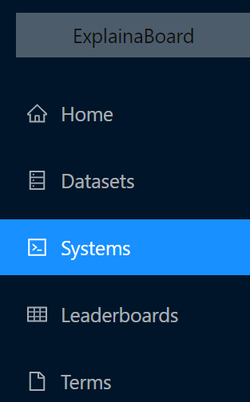
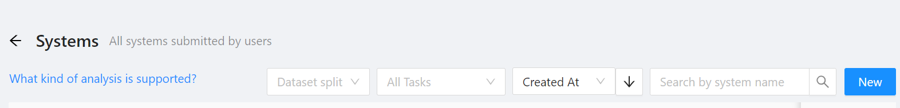

# How to make a submission through ExplainaBoard Web Platform

## Step 1: Sign in and login in
You first need to register an ExplainaBoard account [here](https://explainaboard.inspiredco.ai/).
(Notably: you don't need to have an account if you just aim to browse some public system results or leaderboard.)

## Step 2: Choose the `Systems` bar and click the `New` button.

(1) Choose `Systems` from the navigation menu
 
 
 
(2) Click the `New` button

## Step 3: Fill out the submission form

In this form, you need to fill out the following information
* `System Name`: the name of your system (an intuitive and unique name is recommended, for example, `qa_bert_small`)
* `Task`: select one task that ExplainaBoard supports now. (If your task is not supported yet, you can make an issue
at [the ExplainaBoard SDK repo](https://github.com/neulab/ExplainaBoard) or contribute by [adding a new task](https://github.com/neulab/ExplainaBoard/blob/main/docs/add_new_tasks.md))
* `Use custom dataset`: If your system predictions are run based on a dataset that is not supported by ExplainaBoard, 
you need to choose `use custom dataset?` and upload the test set of your dataset. You can find examples of the required format for each task in our [command-line interface examples](https://github.com/neulab/ExplainaBoard/blob/main/docs/cli_interface.md). Otherwise, you just need to choose a dataset from the `Dataset` check box.
* `Dataset`: Select a dataset that's supported by ExplainaBoard.
* `Metrics`: Select evaluation metrics
* `Make it private?`: If chosen, system outputs together with analysis report can only be observed privately. Otherwise, it will be open to the world.
* `Source code link:` Optional

