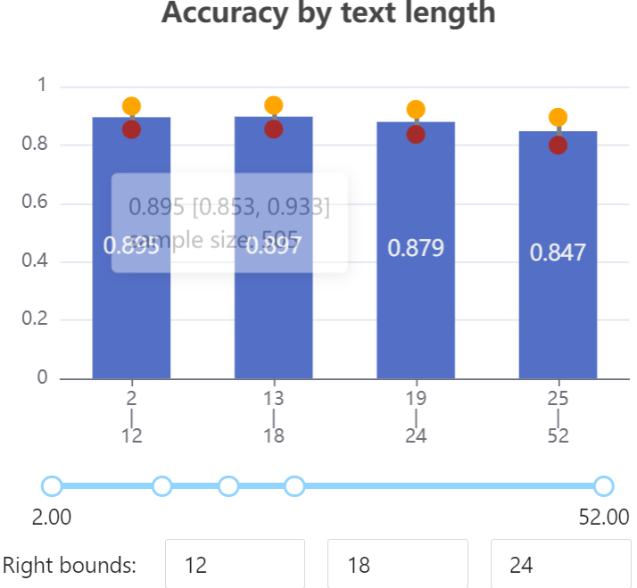
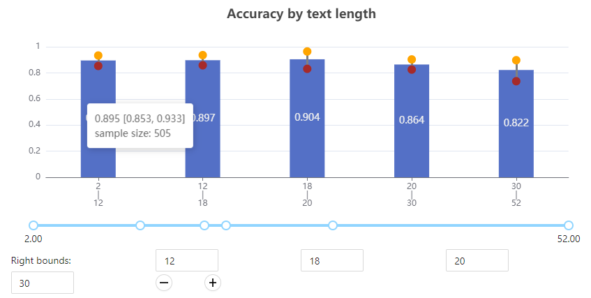
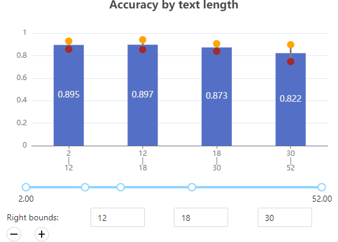

# How to Perform Interactive Evaluation using the ExplainaBoard Web Platform

ExplainaBoard makes it possible to perform interactive evaluation from multiple perspectives:

## Customized Bucket Number

### Background

ExplainaBoard achieves interpretable evaluation by bucketing evaluation performance
into different categories based on some pre-defined features.
For example, according the the text sample's length, system performance could
be grouped into 4 buckets: [2,12], [13,18], [19,24], [25,52].

If you are interested in more details, [Liu et al.2021](https://aclanthology.org/2021.acl-demo.34.pdf), [Fu et al.2020](http://aclanthology.lst.uni-saarland.de/2020.emnlp-main.489.pdf) are highly recommended.

When using ExplainaBoard Web, users can customize the number
of buckets. For example:

#### bucket number: 4

The bucket number could be updated to 5 when

* clicking `+` button
* clicking `Update analysis`

#### bucket number: 5

## Customized Bucket Interval

The bucket interval could also been re-specified by:

* adjusting the position of the circle in the blue line.
* clicking the `Update analysis`

For example:

`[2,12], [13,18], [19,24], [25,52]`  -> `[2,12], [12,18], [18,26], [26,52]`

### bucket number: 5

