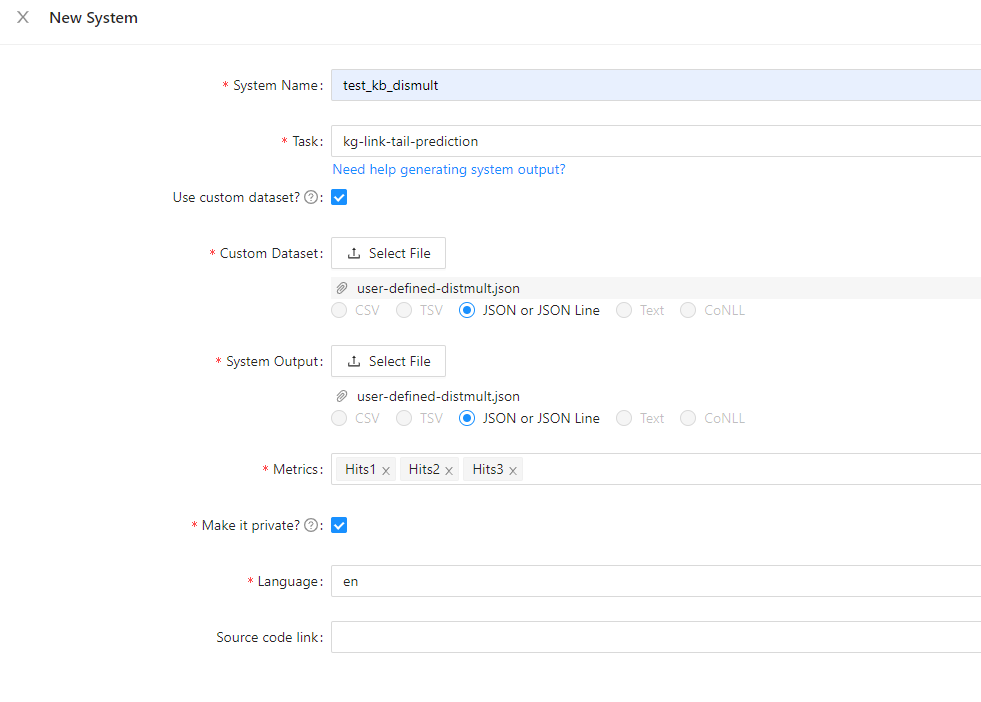

# Analysis Example: Knowledge Graph Task

This doc walks through how knowledge graph-based tasks are evaluated interactively using ExplainaBoard 
web application.

## Prerequisite Docs
* [How to make a submission?](how_to_make_a_submission.md)
* [how to perform interactive evaluation?](how_to_make_interactive_evaluation.md)

## Example

where `user-defined-distmult.json` is the file that can be downloaded [here](https://github.com/PhaelIshall/KGExplainaBoard/tree/main/user-defined).
 